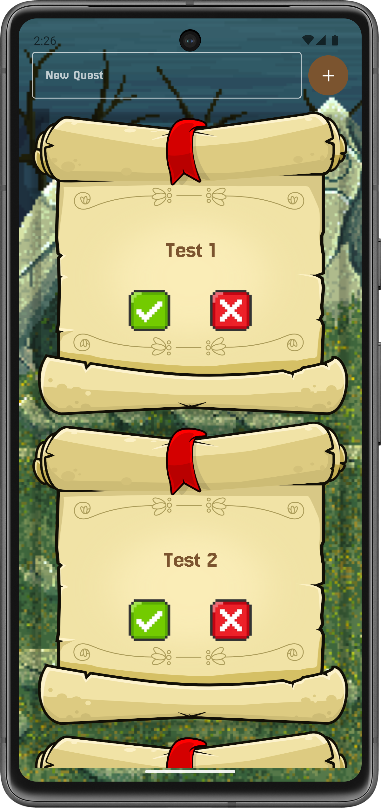

<div align="center">

# ⚔️ Productive Heroes ⚔️

### *Transform Your Tasks into Epic Quests!*

[](https://kotlinlang.org)
[](https://developer.android.com/jetpack/compose)
[](https://android.com)
[](LICENSE)

---

**Tired of boring to-do lists?** 🥱  
**Productive Heroes** transforms your productivity into an exciting RPG adventure! Complete quests, defeat monsters, and level up your character while finishing your daily tasks! 🎮✨

[✨ Features](#-key-features) • [🚀 Installation](#-installation) • [🎯 How to Use](#-how-to-use) • [🛠️ Tech Stack](#️-tech-stack) • [📸 Screenshots](#-screenshots)

</div>

---

## ✨ Key Features

### 🗡️ **Quest Management System**
- 📝 **Add Quests Easily** - Create new tasks quickly and intuitively.
- ✅ **Complete & Delete Quests** - Mark quests as complete to gain +100 EXP or delete them to cancel.
- 🎨 **Pixel Game-style UI** - An RPG Pixel-style design that makes task management fun.
- 💾 **Auto-Save** - All quests are automatically saved using DataStore.

### ⚔️ **Combat & Timer System**
- 🐉 **Fight 4 Unique Monsters**:
  - 👻 **Slime Ghost** (900 HP, +50 EXP)
  - 🦎 **Baby Lizard** (1,200 HP, +100 EXP)
  - 🌳 **Evil Tree** (1,500 HP, +150 EXP)
  - 👤 **The Unknown** (1,800 HP, +200 EXP)
- ⏱️ **Real-time Combat Timer** - Attack monsters automatically with a countdown timer system.
- 🛡️ **Stamina System** - Manage stamina to fight longer.
- 💤 **Rest & Recovery** - Rest your character to recover stamina, adapting the break concept from the Pomodoro timer.

### 📊 **Character Progression**
- 🆙 **Level Up System** - Gain EXP from completing quests and defeating monsters.
- 📈 **Exp Bar** - Visually track your progress to the next level.
- 💪 **Stat Growth** - Character stats increase as you level up.
- 🏆 **Persistent Progress** - Progress is saved even after closing the app.

### 🎮 **UI/UX**
- 🖼️ **Fantasy Theme** - Immersive battle arena design.
- 📱 **Responsive Layout** - Optimized for various screen sizes.
- 🎨 **Fonts** - Jersey25 and Pixelify Sans for a retro gaming feel.

---

## 🚀 Installation
### Quick Install
- Download APK from [release](https://github.com/azwinrx/Productive-Heroes/releases/tag/v1.0)
- Install
- Ready to open

### Prerequisites
- 📱 **Android Studio** (Ladybug 2024.2.1 or newer)
- ☕ **JDK 11** or higher
- 🤖 **Android SDK API 24+** (Android 7.0 Nougat or newer)
- 📦 **Gradle 8.13**

### Installation Steps

1. **Clone Repository**
   ```bash
   git clone https://github.com/azwinrx/Task-Hero.git
   cd Task-Hero
   ```

2. **Open in Android Studio**
   - Select `File` → `Open`
   - Navigate to the project folder
   - Click `OK` and wait for Gradle sync to finish

3. **Build & Run**
   - Connect an Android device or run an emulator
   - Click the `Run` (▶️) button in Android Studio
   - Or use the shortcut `Shift + F10`

4. **Build APK (Optional)**
   ```bash
   ./gradlew assembleDebug
   ```
   The APK will be available at: `app/build/outputs/apk/debug/`

---

## 🎯 How to Use

### 📝 Quest Mode
1. **Add a New Quest**
   - Enter the quest name in the text field.
   - Press the `+` button to add.
   - The quest appears as an attractive card.

2. **Complete a Quest**
   - Press the **✓ (Check)** button on the quest.
   - Get **+100 EXP** for character progress.
   - The quest will disappear from the list.

3. **Delete a Quest**
   - Press the **X (Delete)** button if you want to cancel the quest.
   - You won't get EXP and the quest will be removed.

### ⚔️ Timer Mode (Combat Arena)
1. **Select a Monster**
   - Click the dropdown below the monster GIF.
   - Choose the enemy you want to fight.
   - The monster's HP will be reset, and it will be ready for battle.

2. **Start the Battle**
   - Press the **⚔️ Fight** button to attack.
   - Damage is dealt automatically every second.
   - Stamina will decrease over time.

3. **Manage Stamina**
   - Monitor the stamina bar at the top.
   - Press **💤 Rest** to recover stamina.
   - Press **⏸️ Pause** to temporarily stop the attack.

4. **Defeat the Monster**
   - Reduce the monster's HP to 0.
   - Get an automatic EXP reward.
   - The monster respawns for the next battle.

5. **Level Up!**
   - EXP bar full = Level Up! 🎉
   - Stats increase automatically.

---

## 🛠️ Tech Stack

### 🏗️ Architecture & Frameworks
- **Kotlin** - Modern programming language for Android
- **Jetpack Compose** - Declarative UI toolkit
- **MVVM Architecture** - Clean architecture with ViewModel

### 📚 Libraries & Dependencies
```kotlin
// UI & Design
- Jetpack Compose Material3
- Accompanist Drawable Painter
- Coil (Image Loading & GIF support)

// Data & State Management
- DataStore Preferences (Persistent storage)
- Gson (JSON serialization)
- Lifecycle ViewModel Compose

// Navigation
- Navigation Compose 2.9.5
```

### 🗂️ Project Structure
```
📦 com.azwin.dotask
 ┣ 📂 Model
 ┃ ┣ 📂 Fight
 ┃ ┃ ┣ 📂 Statistic (PlayerData, MonsterData)
 ┃ ┃ ┗ TimerData
 ┃ ┗ 📂 Quest (QuestData, ToDo)
 ┣ 📂 View
 ┃ ┣ 📂 Components (GameButton, StatisticBar)
 ┃ ┣ QuestView
 ┃ ┗ TimerView
 ┣ 📂 ViewModel
 ┃ ┣ 📂 Fight (TimerViewModel)
 ┃ ┗ Quest (QuestViewModel)
 ┣ 📂 Data
 ┃ ┣ QuestRepository
 ┃ ┗ SettingsManager
 ┗ MainActivity.kt
```

---

## 📸 Screenshots




---

## 🎨 Design Features

### 🖼️ Visual Elements
- ✨ **Pixel Art** - Retro-style monsters and UI elements
- 🎭 **Themed Backgrounds** - Themed battle arenas
- 📊 **Animated Progress Bars** - Clear visual feedback
- 🎪 **Hit Effects** - Attack animations during combat

### 🎯 UX Highlights
- 🔄 **Swipe Navigation** - Horizontal pager to switch modes
- 📱 **Always-On Screen** - Screen stays on during combat
- 💾 **Auto-Save** - No save button, everything is automatic
- 🎮 **Game-like Controls** - Simple buttons for desired actions

---

## 🔮 Roadmap & Future Features (if I'm not lazy hehehe)

- [ ] 🏅 **Achievement System** - Unlock badges and rewards
- [ ] 🎨 **Character Customization** - Choose avatar and equipment
- [ ] 📊 **Statistics Dashboard** - View progress and analytics
- [ ] 🌐 **Cloud Sync** - Backup progress to the cloud
- [ ] 🎵 **Sound Effects** - Audio feedback for actions
- [ ] 🌙 **Dark Mode** - Theme customization
- [ ] 🏆 **Leaderboard** - Compete with other players
- [ ] 🗓️ **Daily Quests** - Daily quests with bonus rewards

---

## 🤝 Contributing

Contributions, issues, and feature requests are welcome! 🎉

1. Fork this project
2. Create your feature branch (`git checkout -b feature/AmazingFeature`)
3. Commit your changes (`git commit -m 'Add some AmazingFeature'`)
4. Push to the branch (`git push origin feature/AmazingFeature`)
5. Open a Pull Request

---

## 👨‍💻 Developer

**azwinrx**
- GitHub: [@azwinrx](https://github.com/azwinrx)
- Repository: [Task-Hero](https://github.com/azwinrx/Task-Hero)

---

## 📄 License

This project is licensed under the MIT License - see the [LICENSE](LICENSE) file for details.

---

## 🙏 Asset Credits
- Slime Ghost : https://id.pinterest.com/pin/72972456457340602/ or https://i.gifer.com/PcHK.gif
- Baby Lizard : https://tenor.com/id/view/green-monster-cute-creatures-pixel-monster-cute-monsters-portal-fantasy-game-gif-27138031
- Evil Tree : https://tenor.com/id/view/pixel-pixelart-pixel-game-cute-monster-mossy-gif-27137951
- The Unknown : https://64.media.tumblr.com/01d0f90c74074e8a45825dea194b659f/tumblr_oklrofjnhU1uj3emso1_1280.gif
- Background : https://craftpix.net/freebies/free-pixel-art-fantasy-2d-battlegrounds/
- Scroll Kit : https://gamedeveloperstudio.itch.io/scroll-kit
---

<div align="center">

### ⭐ If this project helps you, give it a Star! ⭐

**I made this project just for fun :)**

[⬆ Back to Top](#️-productive-heroes-️)

</div>
